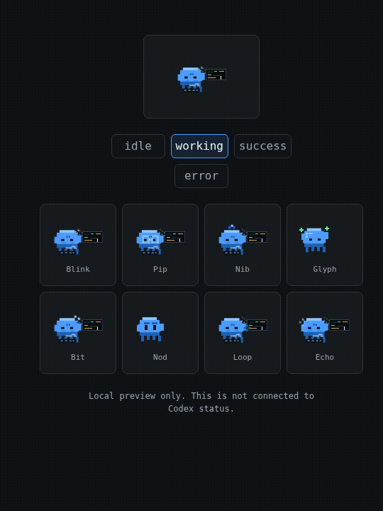

# Codex Dot Companion

Tiny desktop mascots for your Codex sessions.

One running Codex terminal gets one little companion. It works while Codex works,
rests when that session is idle, and keeps the same character for the life of the
Codex process.



> Unofficial third-party project. This is not an OpenAI product.

## Features

- One mascot per running Codex process.
- Stable per-terminal assignment while that Codex process is alive.
- Eight small pixel companions with different idle and working animations.
- Click a mascot name to rename that character.
- Names persist per character in `~/.codex/dot-companion/config.json`.
- Codex hooks automatically switch mascots between working and done states.
- Local browser preview for the roster.

## Install

The fun way is to ask Codex to install it for you.

Open Codex and paste:

```text
Install this for me:
https://github.com/okj1223/codex-dot-companion

Use pipx if it is available. Install the GTK/Cairo desktop dependencies if my
system needs them. Then run codex-dot-install and verify that codex-dot status
shows the overlay is running.
```

Codex should handle the steps, but the manual version is:

```bash
sudo apt install python3-gi gir1.2-gtk-3.0 python3-cairo
pipx install git+https://github.com/okj1223/codex-dot-companion.git
codex-dot-install
codex-dot status
```

## Install From A Clone

```bash
git clone https://github.com/okj1223/codex-dot-companion.git
cd codex-dot-companion
./install.sh
```

Install without starting the overlay:

```bash
./install.sh --no-start
```

## Commands

For a `pipx` install:

```bash
codex-dot status
codex-dot restart
codex-dot idle
codex-dot working
codex-dot mascot-server
```

For a clone install:

```bash
~/.codex/dot-companion/codex-dot status
~/.codex/dot-companion/codex-dot restart
~/.codex/dot-companion/codex-dot mascot-server
```

`mascot-server` prints a local preview URL for the browser roster.

## How It Works

The installer adds two Codex hooks to `~/.codex/hooks.json`:

- `UserPromptSubmit` marks the active Codex process as working.
- `Stop` marks that process as done.

The overlay also watches local Codex session logs so long-running sessions still
look active even when a hook event has already scrolled out of the recent state.

## Privacy

This runs locally.

It reads:

- running process metadata from `/proc`
- local Codex session logs under `~/.codex/sessions`
- its own config and state files under `~/.codex/dot-companion`

It writes:

- `~/.codex/dot-companion/config.json`
- `~/.codex/dot-companion/state.json`
- `~/.codex/dot-companion/assignments.json`
- overlay pid/log files
- companion hook entries in `~/.codex/hooks.json`

It does not send telemetry or make network requests.

## Update

For a `pipx` install:

```bash
pipx upgrade codex-dot-companion
codex-dot-install
codex-dot restart
```

For a clone install:

```bash
cd codex-dot-companion
git pull
./install.sh
```

## Uninstall

Stop the overlay:

```bash
codex-dot stop
# or, for a clone install:
~/.codex/dot-companion/codex-dot stop
```

Then remove `~/.codex/dot-companion` and delete the companion hook entries from
`~/.codex/hooks.json`.

The installer backs up `hooks.json` before writing, using a timestamped
`hooks.json.bak.*` file.

## Notes

- `CODEX_HOME` is supported for non-default Codex config locations.
- Existing non-companion hooks are preserved.
- Companion hooks are replaced on install to avoid duplicates.
- Runtime state is local and is not part of this repository.
